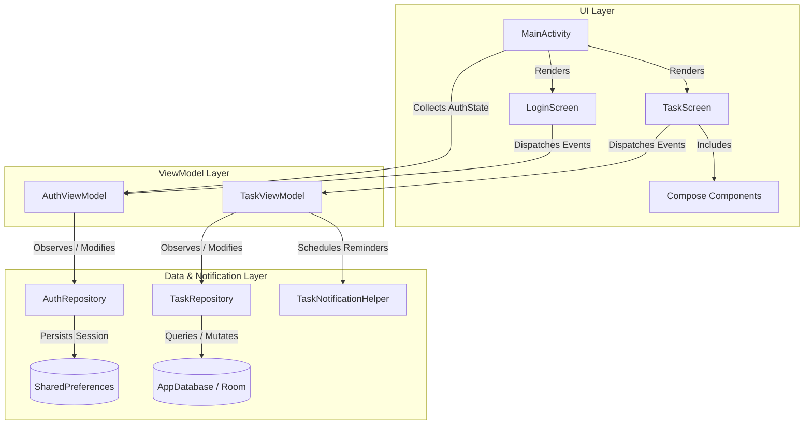

# Daily Task Tracker Architecture

This document describes the architectural patterns, data flow, component design, and technical stack specifications for the Daily Task Tracker Android application.

---

## 1. Architectural Overview

The application adheres to **Modern Android Architecture Guidelines** utilizing **Unidirectional Data Flow (UDF)** and a clean **Layered Architecture**.



---

## 2. Layer Responsibilities

### UI Layer (`com.example.ui`)
- Built entirely using **Jetpack Compose** and **Material Design 3**.
- **Declarative Navigation**: Managed in `MainActivity` based on `AuthState` observed from `AuthViewModel`.
- **Key Screens**:
  - `LoginScreen`: Form for user email/password login, account registration, password toggle, error states, and guest authentication.
  - `TaskScreen`: Main task management dashboard with date selector, daily progress summary, task filters, search bar, and task creation/editing modal sheet.
- **Reusable Components**:
  - `TaskTopAppBar`: Top bar featuring search, notification test action, theme toggle, and logged-in user logout action.
  - `DailyHeaderCard`: Visual card calculating daily completion metrics and pending high-priority items.
  - `DaySelectorBar`: Interactive horizontal date scroll bar.
  - `TaskFilterChips`: Filter tabs (Today, Upcoming, All, Completed) and category chips.
  - `TaskCard`: Task item card supporting completion toggles, edit actions, and deletion.
  - `AddEditTaskSheet`: Bottom sheet form for creating or updating tasks.

### ViewModel Layer (`com.example.ui`)
- **`AuthViewModel`**:
  - Exposes `authState: StateFlow<AuthState>`, `email`, `password`, `displayName`, `isSignUpMode`, `isPasswordVisible`, `isLoading`, and `errorMessage`.
  - Handles authentication actions (`login()`, `signUp()`, `guestLogin()`, `logout()`).
- **`TaskViewModel`**:
  - Exposes `allTasks`, `filteredTasks`, `selectedDate`, `selectedFilterTab`, `selectedCategory`, `searchQuery`, `dailyStats`, and `themeMode`.
  - Manages task CRUD operations via `TaskRepository` and handles alarm notifications via `TaskNotificationHelper`.

### Data Layer (`com.example.data` & `com.example.model`)
- **Domain Models**:
  - `User`: Represents an authenticated user (`id`, `email`, `displayName`).
  - `AuthState`: Sealed class (`Unauthenticated`, `Loading`, `Authenticated(User)`, `Error(String)`).
  - `TaskItem`: Entity model representing a daily task (`id`, `title`, `description`, `dueDateEpochDay`, `dueTimeHour`, `dueTimeMinute`, `priority`, `category`, `isCompleted`, `hasReminder`).
  - `TaskPriority` & `TaskCategory`: Enums for task classification.
- **Network API**:
  - `AuthApiService` (`com.example.data.network`): Retrofit HTTP client interacting with `https://jsonplaceholder.typicode.com/posts` for mock login, registration, and logout POST requests.
- **Repositories**:
  - `AuthRepository` (`AuthRepositoryImpl`): Manages authentication state flow, executes HTTP POST requests via `AuthApiService`, and handles session persistence using `SharedPreferences`.
  - `TaskRepository`: Encapsulates database interactions with Room (`TaskDao`).


### Notification Layer (`com.example.notification`)
- **`TaskNotificationHelper`**: Sets up Android notification channels and schedules/cancels reminders via `AlarmManager` and `PendingIntent`.
- **`TaskReminderReceiver`**: `BroadcastReceiver` triggered when a task reminder alarm fires.
- **`TaskActionReceiver`**: Handles inline notification actions (e.g., marking tasks as complete directly from push notifications).

---

## 3. Technology Stack & Dependencies

### Core Environment
| Component | Version | Description |
| :--- | :--- | :--- |
| **Kotlin** | `2.0.0` | Primary language |
| **Android Gradle Plugin (AGP)** | `8.13.2` | Build tool plugin |
| **Gradle KSP** | `2.0.0-1.0.22` | Kotlin Symbol Processing for Room & Moshi |
| **Compile SDK** | `34` | Android API 34 |
| **Target SDK** | `34` | Android API 34 |
| **Min SDK** | `26` | Android API 26 (Android 8.0 Oreo+) |

### Main Frameworks & Libraries
| Category | Library | Version | Description |
| :--- | :--- | :--- | :--- |
| **UI Framework** | Jetpack Compose BOM | `2024.06.00` | Declarative UI framework |
| **Design System** | Material 3 | Integrated via Compose BOM | Material Design 3 components |
| **Activity Compose** | `androidx.activity:activity-compose` | `1.9.1` | Compose integration for Activity |
| **Lifecycle** | `androidx.lifecycle:lifecycle-*` | `2.8.4` | ViewModels, StateFlow, lifecycle-runtime-compose |
| **Local Database** | Room | `2.6.1` | SQLite ORM with Kotlin Coroutines (`room-ktx`) |
| **Concurrency** | Kotlin Coroutines | `1.8.1` | Asynchronous programming & `StateFlow`/`Flow` |
| **Network & Parsing** | Retrofit, Moshi, OkHttp | Retrofit `2.11.0`, Moshi `1.15.1`, OkHttp `4.12.0` | REST API client & JSON parsing |
| **Cloud Services** | Firebase BOM | `34.18.0` | Firebase AI & AppCheck Integration |

### Testing Stack
| Library | Version | Usage |
| :--- | :--- | :--- |
| **JUnit 4** | `4.13.2` | Unit testing runner |
| **Robolectric** | `4.12.2` | Local JVM Android environment runner (Target SDK 33) |
| **Roborazzi** | `1.12.0` | Visual screenshot regression testing |
| **Kotlinx Coroutines Test** | `1.8.1` | Coroutines testing utilities (`StandardTestDispatcher`, `runTest`) |

---

## 4. Project Directory Structure

```text
app/src/main/java/com/example/
├── MainActivity.kt                 # Entry activity observing AuthState and setting up Compose content
├── TaskApplication.kt              # Application class initializing repositories & database
├── data/
│   ├── AppDatabase.kt              # Room Database configuration
│   ├── AuthRepository.kt           # AuthRepository interface & SharedPreferences implementation
│   ├── AuthState.kt                # AuthState sealed hierarchy
│   ├── TaskConverters.kt           # Room TypeConverters for LocalDate/Priority/Category
│   ├── TaskDao.kt                  # Room Data Access Object for tasks
│   └── TaskRepository.kt           # Task data repository
├── model/
│   ├── TaskCategory.kt             # Task category enum
│   ├── TaskItem.kt                 # Task entity model
│   ├── TaskPriority.kt             # Task priority enum
│   └── User.kt                     # User domain model
├── notification/
│   ├── TaskActionReceiver.kt       # BroadcastReceiver for notification actions
│   ├── TaskNotificationHelper.kt   # Notification channel & AlarmManager scheduler
│   └── TaskReminderReceiver.kt     # BroadcastReceiver for reminder alarms
└── ui/
    ├── AuthViewModel.kt            # ViewModel for authentication logic & screen state
    ├── LoginScreen.kt              # Jetpack Compose login & registration view
    ├── TaskScreen.kt               # Main tasks dashboard view
    ├── TaskViewModel.kt            # ViewModel for tasks dashboard state
    ├── components/
    │   ├── AddEditTaskSheet.kt     # Modal sheet for adding/editing tasks
    │   ├── DailyHeaderCard.kt      # Summary card for daily completion stats
    │   ├── DaySelectorBar.kt       # Horizontal date selection bar
    │   ├── EmptyStateView.kt       # Placeholder view when no tasks exist
    │   ├── TaskCard.kt             # Individual task item card
    │   ├── TaskFilterChips.kt      # Filter tabs & category chips
    │   ├── TaskTopAppBar.kt        # Top app bar with search, theme, notification & logout actions
    │   └── ThemeSelectionDialog.kt # Theme mode selection dialog
    └── theme/
        ├── Color.kt                # Color tokens
        ├── Theme.kt                # Compose MaterialTheme configuration
        └── Type.kt                 # Typography tokens
```
